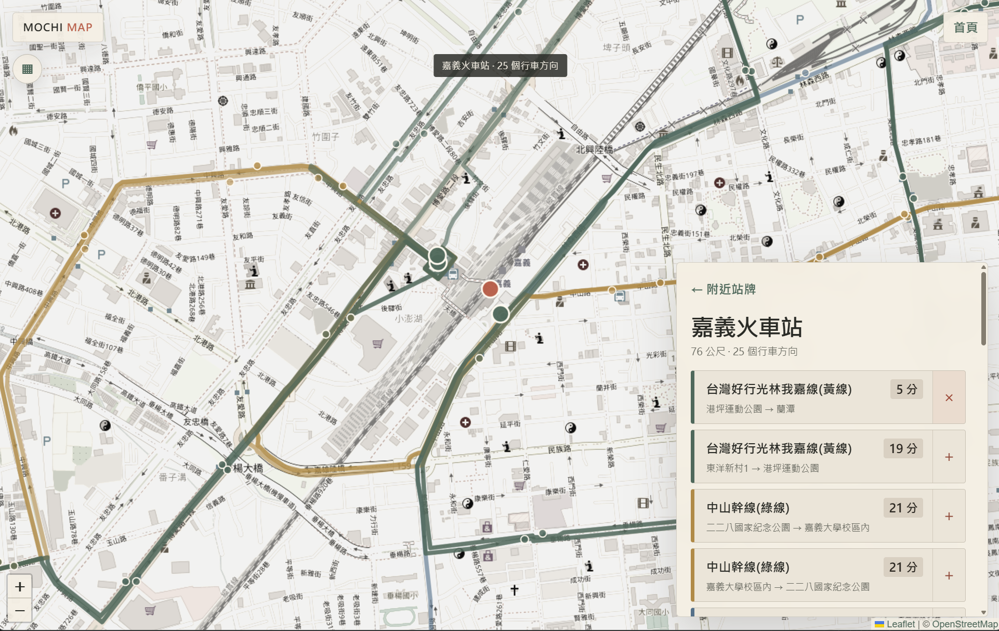

# Mochi Bus

> Understand the network first, then catch the bus.  
>先看懂城市的公車網路，再決定怎麼搭車。

🚌 **線上試用:[bus.moc96336.com](https://bus.moc96336.com/)**

[](https://bus.moc96336.com/map)

---

Mochi Bus 的起點，是一次搭公車時的小抱怨:有些工具有地圖，卻不一定照顧到每個地方的即時資訊;有些工具有即時資訊，卻很難看懂路線在城市裡實際怎麼走。

路線本來就應該畫在地圖上。站牌不只是等車的地方，也是能看見城市交通網路的節點。這個工具不想取代 Google Maps 的導航能力，更想回答另一個問題:「這座城市的公車是怎麼運作的，而我每天的那班車現在在哪?」

台灣公車工具,兩個入口:

- **封面(`/`)**:固定通勤用的極簡看板。只呈現常用站牌與即時 ETA,30 秒自動刷新、切回分頁立即刷新;即時資料中斷時退回時刻表估計(含班距制與發車時間推估)。
- **地圖(`/map`)**:全台 22 縣市的路線地圖。選縣市看路線、展開全城路網、點地圖找附近站牌與到站時間、路線規劃(直達 + 一次轉乘)、即時車輛位置。支援依連線 IP 跳到所在縣市、瀏覽器返回鍵逐層退回、可分享 URL。

跑在 Cloudflare Workers 上:Hono + D1(路網快照)+ R2(線形與時刻表)+ Leaflet/Vite 前端。

產品定位、完整功能清單、設計細節與市面比較:[docs/OVERVIEW.md](docs/OVERVIEW.md)。

## 本機啟動

前置需求:**Node 20+** 和一組免費的 [TDX](https://tdx.transportdata.tw/) 會員憑證(註冊即發)。不需要 Cloudflare 帳號——`wrangler dev` 在本機模擬整個 Workers 環境(含 D1/R2)。

建立 `.dev.vars`:

```dotenv
TDX_CLIENT_ID="你的 Client ID"
TDX_CLIENT_SECRET="你的 Client Secret"
```

```sh
npm install
npm run dev
```

這樣就能跑:地圖直接即時查 TDX,封面看板功能完整。全路網、附近站牌與路線規劃需要路網快照——快照同步腳本目前寫入的是**雲端** D1/R2,所以這些功能要部署自己的一套才有(見下方)。

## 頁面

- `/`:常用站牌看板(ETA 封面)
- `/setup`:建立、刪除、切換常用站牌
- `/route?...`:完整站序與各站 ETA
- `/map`:公車地圖(縣市 → 路線 → 支線 → 站牌,或全路網/附近站牌/路線規劃)
- `/bus?...`:可分享的單班公車查詢
- `/shortcut?...`:iPhone 捷徑純文字輸出

## API 一覽

看板側:

- `/api/v1/routes?city=` 縣市路線目錄
- `/api/v1/stops?city=&route=` 路線方向與完整站序
- `/api/v1/stop-routes?city=&stop=&stopUid=` 同實體站牌附近的公車
- `/api/v1/eta?...` 單班 ETA

地圖側(資料主要來自 D1/R2 快照,即時部分即時打 TDX):

- `/api/v1/map/cities` 縣市中心點與區域
- `/api/v1/map/locate` 依連線 IP 的粗略座標(縣市級,不跳瀏覽器授權)
- `/api/v1/map/routes?city=` 路線目錄
- `/api/v1/map/route?city=&route=` GeoJSON 線形與站牌(含支線)
- `/api/v1/map/network?city=` 全城路網(線 + 站點)
- `/api/v1/map/nearby?city=&lat=&lon=&radius=` 附近站牌
- `/api/v1/map/place/:placeId/arrivals?city=` 站牌到站時間(即時優先,退時刻表)
- `/api/v1/map/direct?city=&from=&to=` 直達路線
- `/api/v1/map/transfer?city=&from=&to=` 一次轉乘方案
- `/api/v1/map/journey-eta`(POST)行程候選的 ETA 排序
- `/api/v1/map/vehicles?city=&route=` 即時車輛位置

## 資料管線

`scripts/sync-chiayi-snapshot.mjs` 從 TDX 抓一個縣市的路線、站牌、線形與時刻表,寫成:

- **D1**(`migrations/0001_transit_snapshot.sql`):routes / patterns / stops / stop_places / pattern_stops,以 `version` 欄位做不可變版本,`dataset_versions` 指向現行版本
- **R2**:每條 pattern 的 GeoJSON 線形、每條路線的時刻表、每站牌的 place bundle、全城 network.json

GitHub Actions(`.github/workflows/sync-transit.yml`)每天跑,縣市按星期分片以壓在 D1 免費額度內;內容沒變的縣市由 hash 檢查跳過。手動 `workflow_dispatch` 可強制重匯單一縣市。

匯入時會把行經本縣市的**公路客運**(TDX InterCity 端點、RouteUID 為 THB 開頭)整條攤進該縣市快照:站牌歸屬依 TDX 的 `LocationCityCode` 判斷,站位靠正規化站名 + 200m 網格跟市區公車自然合併。Worker 端的即時查詢(ETA、時刻表、站序、車輛位置)按 RouteUID 前綴自動切換 City / InterCity 端點。

時刻表支援三種 TDX 形態:逐站時刻、只有起點發車時刻(標為「發車」估計)、班距制(Frequencys,顯示「N–M 分一班」)。超過一小時的估計改顯示絕對時刻(如「17:11 發車」)。

## 快取層級

TDX 回應與資料庫版本查詢走兩層快取:模組層記憶體(isolate 內,擋大多數重複請求)→ Cache API(同機房)。**Cache API 在 `*.workers.dev` 上是 no-op**,必須綁自訂網域才生效;`wrangler.jsonc` 已關閉 workers.dev URL。吃到 TDX 429 時整縣市冷卻 60 秒,期間回放最近一次即時資料並標示 stale。

## 本機資料

常用站牌保存在瀏覽器 localStorage(`mochi.bus.boards.v2` / `mochi.bus.activeBoard.v2`),只保存路線、方向與 UID,不保存 ETA。舊的 `mochi.bus.presets.v1` 首次開啟時自動轉換。

## BYOK:自備 TDX 憑證

線上版內建一組共用 TDX 憑證,讓第一次打開的人不用先研究 API 就能查車。但 TDX 免費額度畢竟不是無底洞;白話一點說,共用額度是我先墊一把,不是大家一起把同一組免費額度喝乾。

所以 `/setup` 的進階設定支援 **Bring Your Own Key**:填入自己的 TDX Client ID / Secret 後,瀏覽器發出的即時查詢會優先走你的額度。憑證只存在這台裝置,不寫進伺服器儲存或 log;如果執行期失效,服務會退回共用憑證,不會直接讓整個看板熄火。

## 驗證與部署自己的一套

需要一個 Cloudflare 帳號(免費方案即可)。先建立 D1 與 R2,把 `wrangler.jsonc` 裡的 `database_id` 換成自己的:

```sh
npx wrangler d1 create mochi-transit
npx wrangler r2 bucket create mochi-transit-shapes
```

接著驗證、設定憑證、部署:

```sh
npm run check        # vitest + tsc + vite build + wrangler dry-run
npx wrangler secret put TDX_CLIENT_ID
npx wrangler secret put TDX_CLIENT_SECRET
npx wrangler d1 migrations apply mochi-transit --remote
npm run deploy
npm run snapshot:city -- Chiayi   # 匯入縣市路網快照(可換;小縣市幾分鐘,雙北量大會久一些)
```

注意 Cache API 在 `*.workers.dev` 網址上是 no-op,要綁自訂網域快取層才會生效。

CI 同步需要的 repo secrets:`TDX_CLIENT_ID`、`TDX_CLIENT_SECRET`、`CLOUDFLARE_API_TOKEN`、`CLOUDFLARE_ACCOUNT_ID`、`R2_ACCESS_KEY_ID`、`R2_SECRET_ACCESS_KEY`。

## 資料與圖資來源

- 公車資料:交通部 [TDX 運輸資料流通服務](https://tdx.transportdata.tw/)
- 底圖:© [OpenStreetMap](https://www.openstreetmap.org/copyright) 貢獻者

## 授權

程式碼以 [Apache-2.0](LICENSE) 授權開源。公車資料與地圖圖資依上述來源各自的授權條款使用。
