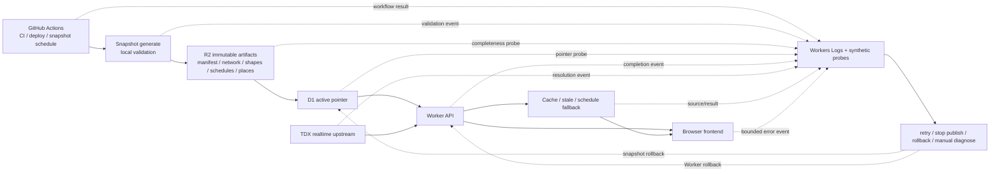

# Mochi Bus 生產可觀測性與故障復原審計 — 2026-07-19

> 本文件記錄唯讀審計結論、隱私安全 telemetry contract 與分批實作順序。A1 已以 `b13057c`、A2 已以 `baea152` 獨立提交並推送；A3 的四個主要 API completion 分母已在本機完成 review/check，尚未提交，且仍未導入第三方平台。

## 1. 結論

目前 snapshot 在「本次發布」失敗時，通常可由 remote validation、production smoke 與 rollback 在約 2–4 分鐘內發現並復原；但部署後、排程外、`unchanged`、部分 R2 artifact 遺失、TDX 回傳 200 空資料，以及瀏覽器 boot/runtime error，大多沒有持續訊號，最短發現時間是不確定或直到使用者回報。

第一階段不需要先買監控平台。應先建立可計算成功分母、不可攜帶敏感資料、能關聯 release／city／snapshot 的結構化事件，再由 GitHub Actions 做 release smoke、城市 freshness 與 artifact probe。只有事件量與查詢需求證明 Workers Logs 不夠時，才評估 Analytics Engine、Tail Worker 或第三方 error tracking。

## 2. Production failure detection chain

必要因果鍵為 `releaseSha + workerVersionId + city + snapshotVersion + operation`；`deploymentId` 只有在 CI／Cloudflare deployment API 能可靠提供時才加入。缺少 release 或 snapshot 軸時，只能知道「有錯」，不能可靠判斷是 Worker、城市資料、artifact、TDX 或瀏覽器造成。

## 3. 現有能力與盲區

| 層級 | 可觀測成功／失敗 | 現有能力 | 主要盲區 | 可採取恢復 |
| --- | --- | --- | --- | --- |
| GitHub Actions／部署 | quality、Playwright、deploy job 結果 | CI gate；部署失敗可見 | deploy 成功後沒有 release-specific smoke、觀察窗或 release correlation | 重跑 workflow；手動回退 Worker |
| snapshot 產生／發布 | local/remote validation、publish phase、public smoke、rollback | immutable artifact、manifest hash/count、publish gate | `unchanged` 不證明 active 資料仍完整；沒有每個 window 的 durable outcome | retry；停止 activate；回復 previous pointer |
| D1 active pointer | 新 version 可查、smoke 可讀 | activate 前後有 gate | 日常無 pointer freshness；rollback 後 D1 與 R2 state 可能分叉 | 指向 previous version；之後需 reconcile state |
| R2 artifacts | 發布時檢查 critical classes 與 integrity | manifest、network、shape、schedule、place bundle remote validation | 發布後遺失或個別 place 404 無定時 probe；previous 可用性未持續驗證 | 重新上傳 immutable artifact；切 previous |
| Worker API | uncaught exception、零散 structured log | Workers Logs 已啟用；部分 cache、rate-limit、TDX log | 沒有同 cohort 的 success 分母；raw error 欄位不一致；沒有 deployment ID | retry、降級、Worker rollback |
| TDX realtime | 部分 401/429/5xx log 與 fallback | token refresh、stale/schedule fallback | 無 resolution completion 分母；200 空陣列無法分辨合法空、identity miss 或契約錯誤 | 一次 refresh/retry；stale/schedule；人工查上游 |
| Cache／fallback | response metadata 可標 stale/schedule | stale 與 schedule 可維持可用性 | 無城市／operation fallback 比率；degraded 可能長期不被發現 | 清 cache、等待 upstream、維持明確 degraded |
| browser frontend | Playwright CI 中 page error | desktop/touch 核心流程測試 | 真實使用者的 boot、asset、history hydration、contract parse error 不可見 | UI retry；Worker rollback；前端修版 |

Cloudflare 現行建議以 object 形式寫入結構化 JSON，讓 Workers Logs 可依欄位查詢；Phase A1 emitter 因此輸出已驗證物件，而非任意文字或 request body。參考：[Workers Logs](https://developers.cloudflare.com/workers/observability/logs/workers-logs/)、[Workers best practices](https://developers.cloudflare.com/workers/best-practices/workers-best-practices/)。

## 4. 具體發現

| ID | 分類 | 嚴重度／信心 | 實際故障情境 | 現在能否發現／最短時間 | 現有恢復 | 最小改善 |
| --- | --- | --- | --- | --- | --- | --- |
| OBS-01 | Deploy detection | 高／高 | Worker deploy 成功，但 `/map` 新 bundle boot 失敗 | 否；直到使用者回報 | 手動回退 commit/deploy | deploy 後 release-specific HTTP + fresh-browser smoke，失敗停止後續發布 |
| OBS-02 | Release correlation | 高／高 | API error 上升，但 log 無法對應實際 Worker version | 部分；無法可靠歸因 | 人工比對 deploy 時間 | A2 加 Version Metadata binding 與 CI release SHA；所有事件共用 identity |
| OBS-03 | Denominator | 高／高 | 只看到 429／fallback error，不知道佔 10 次還是 10 萬次請求 | 否；錯誤率不可計算 | 個案 retry／人工看 log | 同一 sampling cohort 發 `api_operation_completed` 與 `tdx_resolution_completed` |
| OBS-04 | Snapshot unchanged | 高／高 | source hash 未變而 workflow early-exit，但 active R2 artifact 已遺失 | 否；可能等特定使用者讀到 | 手動重跑 force publish | `unchanged` 前 probe active D1、manifest、critical artifacts 與抽樣 place |
| OBS-05 | City freshness | 高／高 | 某城市本週 workflow 未跑完，舊 snapshot 仍服務 | job failure 可見，但無城市狀態；約數小時至人工查看 | 重跑單城市；舊 snapshot 繼續 | 每 window 記 `lastAttemptAt/lastSourceCheckAt/lastPublishedAt/result/windowId` |
| OBS-06 | Artifact completeness | 高／高 | routes 正常，但部分 place bundles 大量 404 | 發布當下可；日後不可，直到使用者命中 | 切 previous 或重建 artifacts | 每日 22 城市 rotating route/place + active/previous completeness probe |
| OBS-07 | Realtime semantics | 高／高 | vehicles 200 空陣列，可能是非營運、合法無車、route identity miss 或 upstream degraded | 否；現有空陣列缺原因 | fallback 或人工查 TDX | completion event 同時記 result/source/failureClass；以 timetable/service window 與 identity probe 分類 |
| OBS-08 | Frontend errors | 高／高 | chunk load、map init、history hydration 或 repeated recovery loop | CI 特定路徑可；production organic 不可 | reload、UI retry、重新 deploy | bounded frontend event，sampling、dedupe、release correlation；CSP 保持獨立 |
| OBS-09 | Rollback authority | 高／中高 | D1 回到 v1，但 R2 state 仍稱 current=v2，下一次 rollback target 錯 | smoke 可能成功，狀態分叉本身不會被看見 | 人工修 D1/R2 state | 明定 D1 `active_version` 為服務權威；rollback 後 reconcile R2 metadata，失敗 fail closed |
| OBS-10 | Privacy contract | 中高／高 | 現有各處直接記 raw `error.message` 或任意欄位，未來擴充容易帶入 credential/query | log 可見，但隱私風險本身不告警 | 人工刪 log／修程式 | A1 strict allowlist、禁止欄位、safe fingerprint 與 fail-open emitter；後續逐路由遷移 |

相關流程與檔案：`.github/workflows/ci.yml`、`.github/workflows/sync-transit.yml`、`wrangler.jsonc`、`scripts/sync-transit-snapshot.mjs`、`scripts/transit-snapshot/publish-gate.mjs`、`scripts/transit-snapshot/rollback.mjs`、`src/infrastructure/transit/snapshot-repository.ts`、`src/lib/tdx.ts`、`src/lib/edge-cache.ts`、`src/rate-limit.ts`、`src/routes/map.ts`、`src/routes/bus.ts`、`src/index.ts` 與前端 `web/map`、`web/setup`、`web/eta`。

## 5. Telemetry event／metric contract

### 5.1 Common envelope

所有事件必須通過 allowlist validator，且分母欄位不得省略：

| 欄位 | 契約 |
| --- | --- |
| `eventSchema` | 數字 schema version；A3 加入嚴格空資料／品質欄位後為 `2` |
| `event` | allowlist event name |
| `releaseSha` | Git SHA 或 `null`；A2 才注入 |
| `workerVersionId` | Cloudflare Worker version ID 或 `null`；A2 才注入 |
| `workerCreatedAt` | Version Metadata timestamp 的正規化 ISO 時間或 `null`；A2 才注入 |
| `deploymentId` | 本輪固定 `null`；不得用 Worker version ID 冒充 deployment ID |
| `city` | 22 個 TDX city code 之一或 `null` |
| `operation` | allowlist operation；不得使用完整 path/URL |
| `result` | `success | degraded | empty | error` |
| `source` | `realtime | stale | schedule | snapshot | fallback | mixed | browser | worker | none` |
| `snapshotVersion` | bounded identifier 或 `null` |
| `httpStatusClass` | `2xx | 3xx | 4xx | 5xx | none`；不得記完整 request |
| `latencyBucket` | `lt_50ms | 50_199ms | 200_999ms | 1_3s | 3_6s | gt_6s | unknown` |
| `cacheResult` | `memory_hit | edge_hit | miss | bypass | error | unknown | not_applicable`；A3 無可靠 cache provenance 時固定 `unknown`，不得猜測 |
| `trafficClass` | `user | synthetic | snapshot_publish` |
| `sampleProbability` | `(0, 1]`；success 與 failure 必須用同 cohort 規則 |
| `failureClass` | bounded enum；成功為 `none`，TDX 至少區分 401/429/quota/timeout/5xx/invalid payload |
| `emptyReason` | 嚴格 enum；非空通常為 `not_applicable`，空資料至少區分 no routes/arrivals/vehicles、identity mismatch、invalid coordinates、all estimates unknown、upstream failure、route-object fallback |
| `qualityBucket` | 嚴格 enum；journey 為 `complete_realtime | complete_mixed | complete_schedule | partial_unknown | all_unknown`，其他 operation 為 `not_applicable` |
| `errorFingerprint` | 選填；只能由 error type、asset basename、25-line bucket 產生的短 SHA-256 |

Phase A1 event allowlist：`api_operation_completed`、`tdx_resolution_completed`、`snapshot_window_completed`、`snapshot_probe_completed`、`snapshot_fallback_selected`、`rate_limit_decision`、`circuit_state_changed`、`release_smoke_completed`、`frontend_boot_completed`、`frontend_error`。

### 5.2 禁止欄位

整筆拒絕，不是裁掉後送出：

- Client Secret、access token、Authorization header、credential fingerprint。
- 原始 IP 或 IP hash。
- 精確經緯度。
- 完整 URL、query string、搜尋詞、request/response body。
- 車牌。
- 可重新識別使用者的 board、place selection 或 journey identity。
- raw error message、cause、stack。

### 5.3 成功分母與比例

`api_operation_completed` 必須在被抽樣的每次 operation 結束時恰好出現一次；error、empty、degraded、success 共用相同 sampling decision。`sampleProbability` 用於校正不同 cohort，不能只抽 success 或只記 error。

A3 的 organic API cohort 在 operation 開始時以 10% 固定決策；同一次 operation 後續走 success、fallback、early return 或 catch 都沿用該決策。`synthetic` 與 `snapshot_publish` 為 100%。目前四個產品 callsite 都標成 `user`；後續 release smoke 必須由受信任的內部流程傳入 `synthetic`，不得接受可由公開 request header 任意偽造的 traffic class。

分母邊界：handler 內的 query/body validation、coded BYOK 401、upstream failure、fallback 與正常回應都納入；發生在 handler 前的全域 API rate-limit 429，以及 journey `bodyLimit` 的 413 不納入 A3 operation 分母，未來分別由 `rate_limit_decision`／保護層事件計數。這是明確契約，不依 middleware 排列偶然決定。

| 指標 | 分子／分母 |
| --- | --- |
| API realtime success rate | `source=realtime,result=success` / 同 city+operation 的全部 `api_operation_completed` |
| TDX resolution success rate（A4） | `source=realtime,result=success` / 同 cohort 的全部 `tdx_resolution_completed` |
| stale replay rate | `source=stale` / 同 cohort operation 或 resolution total；事件種類不得混用 |
| schedule fallback rate | `source=schedule|fallback` / 同 cohort operation 或 resolution total；事件種類不得混用 |
| unavailable rate | `result=error,source=none` / 同 cohort operation total |
| TDX failure class rate | 指定 `failureClass` / 全部 TDX resolution total |
| empty vehicles rate | `operation=map_vehicles,result=empty` / vehicles total；另依 service window、identity probe、failureClass 分群 |
| journey unknown rate | journey ETA 的 `qualityBucket=partial_unknown|all_unknown` / journey ETA total |
| arrivals schedule-only rate | place arrivals `source=schedule|fallback` 且仍有資料 / place arrivals total |

`empty` 不是故障同義詞。vehicles 至少再以「營運時段／非營運時段」、「route identity probe 成功／失敗」、「upstream success／degraded」、「契約 parse 成功／失敗」診斷；只有 identity 或契約失敗、或與歷史基線顯著偏離時才升級。

### 5.4 A3 四個 operation 的 result/source 契約

| operation | success | degraded | empty | error |
| --- | --- | --- | --- | --- |
| `map_routes` | snapshot catalogue 可用／`snapshot` | snapshot 無資料而 TDX static catalogue 可用／`fallback` | fallback 成功但確無 routes／`fallback + no_routes` | validation、D1 或 fallback 無有效 response／`none` |
| `map_place_arrivals` | bundle + realtime 完整／`realtime` | stale、schedule、mixed、route-object fallback 或帶 warning／對應 source | bundle 與來源成功但確無 arrivals／`none + no_arrivals` | validation、coded 401 或 operation failure／`none` |
| `map_vehicles` | upstream 有有效且符合 identity/座標的 vehicles／`realtime` | upstream failure 後仍回可操作的 warning + empty／`fallback + upstream_failure` | upstream schema 成功，依序區分 `no_vehicles`、`identity_mismatch`、`invalid_coordinates` | validation、coded 401 或 response 無法形成／`none` |
| `map_journey_eta` | 所有 requested legs 都解析且有 realtime／`realtime` | realtime/schedule mixed、schedule/departure/headway、unresolved leg／partial unknown、或 warning 後 all unknown／對應 source + quality bucket | 成功完成解析但全部 unknown／`none + all_estimates_unknown` | validation、coded 401 或 operation failure／`none` |

A3 尚不能可靠區分 TDX invalid JSON 與一般 5xx、memory/edge/upstream cache provenance、合法空車發生於非營運時段或 route identity 本身不存在，以及 journey schedule 最終來自 snapshot 或 TDX。這些不猜測；A4 由 TDX/cache resolution 回傳最小的 bounded internal metadata，再發 `tdx_resolution_completed`。

## 6. 22 城市 probe 與 freshness contract

排程固定於 UTC 19:17 執行，台灣時間為次日 03:17；workflow timeout 為 180 分鐘。以台灣時間 07:30 作為該 window 的最晚允許完成時間，不能用固定「三天未更新」套用所有城市。

| UTC weekday／台灣執行日 | 城市 |
| --- | --- |
| Mon／Tue 03:17 | Chiayi、Keelung、Hsinchu、HsinchuCounty |
| Tue／Wed 03:17 | Tainan、MiaoliCounty、NantouCounty、PenghuCounty、KinmenCounty、LienchiangCounty |
| Wed／Thu 03:17 | ChiayiCounty、ChanghuaCounty、PingtungCounty |
| Thu／Fri 03:17 | Taichung |
| Fri／Sat 03:17 | Kaohsiung、YunlinCounty |
| Sat／Sun 03:17 | Taoyuan、YilanCounty、HualienCounty、TaitungCounty |
| Sun／Mon 03:17 | Taipei、NewTaipei |

每個 city/window 記錄：

- `windowId`：預定 UTC date + city。
- `lastAttemptAt`：workflow 開始處理城市。
- `lastSourceCheckAt`：確認過 TDX source hash／資料的時間。
- `lastPublishedAt`：只有 activate 成功才更新。
- `result`：`published | unchanged | failed | missing`。
- active／previous snapshot version 與 probe outcome。

判定：

- 07:30 前尚未完成：處理中，不告警。
- 07:30 後無 outcome：`missing`，Yellow；立即 retry 單城市。
- `failed` 但 active snapshot 全部 probe 可用：Yellow，停止該城市新發布，保留舊 snapshot。
- `unchanged` 但 active probe 失敗：Red，不得把 unchanged 當成功。
- active pointer、manifest、network 或主要 routes 不可用：Red。
- rotating shape/schedule/place sample 失敗：Yellow；若影響 catalogue 中可達 route/place 或失敗比例超門檻，Red。
- active 與 previous 都不可用：Red；只有 previous 可用時先切 previous。
- 連續兩個預定 window 未完成：至少 Yellow；active 已不可用則 Red。

### Artifact completeness probe

每城至少檢查：D1 active pointer、R2 manifest、network、至少一個 shape、schedule 與 place bundle、catalogue route 對 pattern/artifact 的引用、active 與 previous version 可讀性，以及 cleanup 沒有刪除兩者。抽樣 target 每日輪換，並保留固定 canary route/place 便於基線比較。

### Probe placement 比較

| 方案 | 能發現 | 不能發現／限制 | 第一階段 |
| --- | --- | --- | --- |
| workflow 後立即驗證 | 本次新 artifact、pointer、public serving | 日後遺失；排程根本沒跑；unchanged 盲區 | 保留並補事件 |
| 定時 GitHub Action | 22 城市 freshness、active/previous、HTTP contract | Worker 內部細節；分鐘級即時異常 | 是，Phase A |
| 每日 synthetic probe | 城市級日常完整性與 baseline drift | deploy 當下數分鐘回歸 | 是，與定時 Action 合併 |
| 外部 uptime monitor | DNS/TLS/邊緣與獨立觀測面 | 深層城市/artifact 語意 | 後續僅做少量公共入口 |
| Worker scheduled job | 接近 bindings、可低延遲聚合 | 與 Worker 同 failure domain；增加持久化設計 | Phase B 視需求 |

## 7. Deploy smoke／rollback decision matrix

最小流程：deploy → 取得 release identity → HTTP assets/pages smoke → 大城與小城 routes/network → degraded arrivals contract → journey ETA → fresh browser boot/pageerror → 10–15 分鐘觀察窗 → promote/stop/rollback。

| 訊號 | 自動動作 | 是否自動 rollback | 理由 |
| --- | --- | --- | --- |
| observed release ID 不等於剛部署 ID | 停止後續發布並重試 probe | 否 | 可能是 propagation；尚未證明新 release 壞掉 |
| `/`、`/setup`、`/map` 或 hashed JS/CSS 持續 404/5xx | 停止發布 | 是，確認命中新 release 且跨 PoP/重試仍失敗後 | release-specific、可重現、核心不可用 |
| fresh browser 無 boot marker、pageerror 或 asset load failure | 停止發布 | 是，重試仍失敗且 release-specific | 使用者無法操作且與部署直接相關 |
| 代表性 routes/network schema 解析失敗 | 停止發布 | 是，若 previous release 同資料可成功 | 明確程式／契約回歸 |
| 單城 artifact 404、其他城市正常 | 停止該 snapshot 發布；切 previous | 否 Worker rollback | 資料版本問題，不應回退無關 Worker |
| TDX 429/quota/timeout 或 fallback rate 上升 | 告警、延長觀察、保留 fallback | 否 | 外部 upstream，Worker rollback 通常無效 |
| vehicles empty rate 上升 | 診斷 service window/identity/upstream | 否 | 空資料不是單一故障證據 |
| frontend organic error 持續超 baseline 且高度集中新 release | 停止發布，人工確認 | 條件式 | 需有成功分母、sampling 與 release concentration |

不建議 smoke 首次失敗就無條件自動 rollback；先確認 probe 命中剛部署 release、重試可重現、previous release 對相同資料成功。硬性 rollback 只用 release-specific 核心 boot/asset/contract failure。TDX、單城 snapshot 與低量 frontend 訊號先停止發布並告警。

## 8. 城市健康：硬性狀態＋診斷分數

硬性狀態優先，分數只協助排序調查：

- **Green**：本 window outcome 完整；active pointer 與 critical artifacts 可用；核心 routes/network contract 成功。
- **Yellow / Degraded**：missed/failed window 但舊 active 可用；部分抽樣 artifact 失敗；realtime fallback/latency 顯著升高但 schedule/stale 可用。
- **Red / Unavailable**：active pointer 不存在；manifest/network/core routes 不可用；active 與 previous 都失敗；或主要 API 對該城持續無可用 fallback。
- **Unknown / No signal**：本 window/probe 沒有成功也沒有失敗事件，或 success denominator 中斷。Unknown 不得被當 Green。

診斷分數可用 freshness、artifact completeness、route usability、realtime availability、fallback rate、API latency、frontend errors、recent release correlation 八維各 0–100。任何 Red 硬條件直接覆蓋分數；單一 fallback/latency/organic error 異常通常只扣分或升 Yellow。

## 9. 工具選型

| 工具 | 適合事件／聚合 | 成本與限制 | 隱私風險 | 第一階段 |
| --- | --- | --- | --- | --- |
| Workers Logs／structured logs | API/TDX completion、release/city filter、個案診斷 | 現成；保留/查詢受方案限制 | schema 不嚴格時可能洩漏 | 是 |
| GitHub Actions synthetic | snapshot window、22 城市 HTTP/artifact probe、deploy smoke | 執行分鐘與 artifact 成本；非即時 | 低，使用固定 canary | 是 |
| 自建城市 health endpoint | 對外/內部呈現硬狀態與最近 probe | 需 durable store、權限與 cache | 不可暴露內部錯誤或敏感 probe | Phase B |
| Analytics Engine | 高量率值、城市/operation 聚合 | 需 schema/query/成本驗證 | 欄位設計不當仍有風險 | Phase C |
| Tail Worker | 集中過濾、抽樣、轉送多 Worker log | 增加 failure domain 與維運 | 可接觸大量 trace metadata | Phase C |
| 外部 uptime monitor | DNS/TLS/核心公共頁面獨立監看 | 外部費用；語意有限 | URL/query 設計需固定 | Phase B/C 少量 |
| 第三方 error tracking | source map、frontend release trend | SDK、成本、資料跨境/保留 | 最高，需額外 DPIA/過濾 | 僅 Phase C 有證據後 |

## 10. 三階段實作方案

### Phase A：既有 Workers Logs、GitHub Actions、結構化事件

每項可獨立由 High 處理的小 PR：

1. **A1 telemetry schema/privacy boundary**：allowlist enums、common envelope、禁止欄位 validator、safe fingerprint、fail-open emitter、單元測試；不接產品路由。
2. **A2 release identity**：Cloudflare Version Metadata binding、完整 Git SHA version tag、唯讀 release endpoint 與 telemetry envelope builder；`deploymentId` 固定 `null`，不包含 post-deploy smoke。參考：[Version metadata binding](https://developers.cloudflare.com/workers/runtime-apis/bindings/version-metadata/)。
3. **A3 API completion denominator**：只接 map routes、place arrivals、vehicles、journey ETA；每次 sampled operation 一個 completion event，同 cohort success denominator。
4. **A4 TDX resolution completion**：由 TDX/cache 邊界回傳 bounded source/failure/recovery metadata；不重複發 API completion。
5. **A5 rollback authority**：D1 為服務權威，rollback 後同步 R2 state，加入 divergence test。
6. **A6 snapshot window records**：weekly window outcome 與 07:30 close 判定。
7. **A7 unchanged active probe**：early-exit 前驗 D1/R2/critical artifacts/rotating sample。
8. **A8 post-deploy HTTP smoke**：release-specific pages/assets、大城小城 API、degraded contract。
9. **A9 fresh-browser smoke**：全新 context、boot marker、pageerror、unhandled rejection、asset failure。
10. **A10 frontend organic collector**：bounded payload、URL query removal、sampling、dedupe、rate limit；與 CSP route 分開。
11. **A11 daily 22-city probe**：硬狀態輸出、active/previous 與 rotating artifacts。

### Phase B：城市級聚合與健康頁面

1. 將 Phase A probe outcome 寫入最小 durable health store。
2. 建立內部或受限的 city health endpoint，只回硬狀態、各維度與最近時間，不回原始錯誤。
3. 建立 dashboard/runbook：retry、stop publish、snapshot rollback、Worker rollback 的責任與門檻。
4. 少量外部 uptime probe 只覆蓋 DNS/TLS/首頁/map，不傳動態 query。

### Phase C：資料量與需求證明後才擴充

1. Workers Logs 無法有效計算高量率值時，才以 Analytics Engine 聚合固定低基數欄位。
2. 需要跨 Worker 集中過濾或轉送時，才加入 Tail Worker。
3. 只有 frontend 錯誤量、source map 與 triage 成本證明必要時，才評估第三方 error tracking。

本階段明確不做：全量 request logging、Tail Worker、Analytics Engine、第三方 tracking、不透明單一健康分數、以及僅憑一個 metric 自動 rollback。

## 11. 執行狀態

| 批次 | 狀態 | 驗證 |
| --- | --- | --- |
| A1 telemetry schema/privacy boundary | 已提交並推送（`b13057c`） | `src/observability/telemetry.ts`；完整 check 54 files、354 tests、typecheck、build、Worker dry-run 通過；沒有產品 callsite |
| A2 release identity | 已提交並推送（`baea152`） | Version Metadata binding、生成型別、release helper/endpoint、CI full-SHA tag/message；targeted 53/53、完整 check 55 files/367 tests、typecheck、build、Worker dry-run 與含 tag/message 的 deploy dry-run 通過 |
| A3 API completion denominator | 本機實作與 review/check 完成，待獨立提交 | schema v2、complete-once tracker、固定 cohort sampling、四個 route callsite 與 result/source/empty/quality contract；targeted 5 files/63 tests、完整 check 58 files/390 tests、typecheck、build、Worker dry-run 通過；不含 `tdx_resolution_completed` |
| A4–A11 | 已排程，未開始 | 各批保持可獨立 review/rollback |
| Phase B/C | 未開始 | 等 Phase A 事件量與操作需求證明 |

## 12. 最值得先實作的三項

1. A1 telemetry schema 與隱私邊界。
2. A2 release identity，讓部署、log 與 smoke 能對到同一版。
3. A3 API completion events，先建立 realtime、fallback、empty 與 error 的成功分母；A4 再補底層 TDX resolution。
